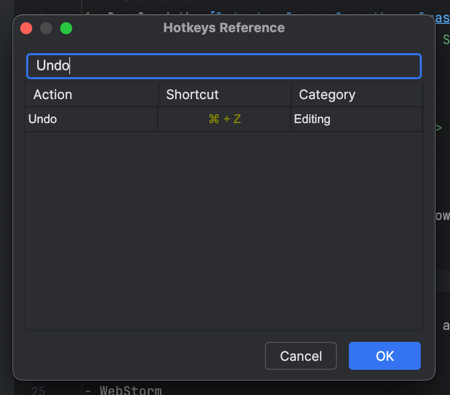

# HotKeys reference plugin for JetBrains
_A simple plugin to display a cheat sheet of hotkeys in PyCharm and other JetBrains IDEs_

---
Author: [Nikita Aksenov](https://nawinds.dev/) (группа M3104 ИТМО)

## Installation
1. Download the [latest release from the releases page](https://github.com/nawinds/hotkeys_reference_plugin_for_jetbrains/releases/latest) which is a .zip file.
2. Open your JetBrains IDE and go to `File -> Settings -> Plugins -> Install Plugin from Disk...` and select the downloaded .zip file.
3. Restart your IDE.

## Usage
To open the hotkeys reference, go to `Tools -> Show HotKeys` or use the shortcut `Ctrl + Shift + H` (or `⌘ + Shift + H` on macOS).

The hotkeys reference will open in a new window, and you can search for hotkeys by typing in the search bar at the top.

You can also click on the table headers to sort the hotkeys by the column.

## Supported IDEs
The plugin should work in all JetBrains IDEs, and have been tested in the following:
- PyCharm
- IntelliJ IDEA
- WebStorm
- GoLand
- CLion